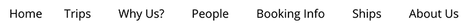
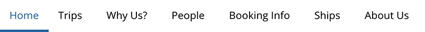
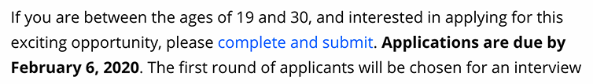
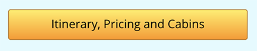
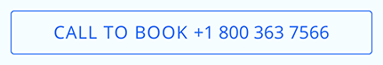
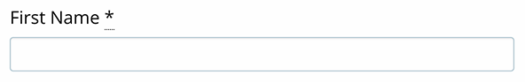
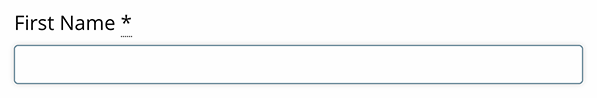
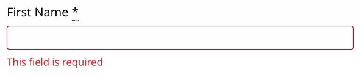
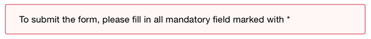
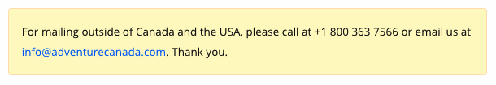

# Adventure Canada:   Visual Style Guide

## Logotype

**IMPORTANT NOTES**
* Always use SVG logo file format. If that is not possible use PNG version.

* Logo MUST always be placed on the white background. 

* When placing the logo on the top of an image or background that is not white, logo must be placed inside the white container.

* Always keep logo proportional as in the original file provided below.

---

**SVG logo on the white background**

---

**SVG logo - transparent** *Always place this logo on the white background*

---

**PNG logo on the white background**

---

**PNG logo - transparent** *Always place this logo on the white background*

---

##Typography

Adventure Canada's web fonts are served via Adobe Fonts. To use fonts on a web page, copy this code into the `<head>` tag of your HTML. 

    <link rel="stylesheet" href="https://use.typekit.net/kkm3zcw.css">

Adventure Canada is using two type foundries:
* Museo Slab for headlines
* Open Sans for body text

##Headlines (h1, h2, h3, h4, h5, h6)

	font-family: museo,Georgia,Cambria,serif;
	font-weight: 500;
	font-style: normal;
	color: #000;
	
###Headline Size

**Default (small screen)**

	h1, .h1 { font-size: 36px; }
	h2, .h2 { font-size: 28px; }
	h3, .h3 { font-size: 22px; }
	h4, .h4 { font-size: 18px; }
	h5, .h5 { font-size: 16px; }
	h6, .h6 { font-size: 16px; }
    
**Medium Up**

	h1, .h1 { font-size: 48px; }
	h2, .h2 { font-size: 40px; }
	h3, .h3 { font-size: 32px; }
	h4, .h4 { font-size: 28px; }
	h5, .h5 { font-size: 20px; }
	h6, .h6 { font-size: 20px; }

**Rules to follow:** 

* Headlines shoud be title case
* Never use all capital letters
* If headlines appear too big or too small, you can utilize class styling to change the size without affecting the markup

##Body text (all elements except headlines)

	font-family: 'open-sans',Gill Sans,Helvetica Neue,Helvetica,Roboto,Arial,sans-serif;
	
###Font Size
**Note:** Base font size is 16px or 100%

**Default (small screen)**

	font-size: 100%; /* or 16px */
    
**Medium**

	font-size: 112.5%; /* or 18px */
	
**Large Up**

	font-size: 125%; /* or 20px */
	
###Style and Weight	

**Regular**

	color: #000;
	font-weight: 400;
	font-style: normal;

**Italic**

	color: #000;
	font-weight: 400;
	font-style: italic;

**Bold**

	color: #000;
	font-weight: 700;
	font-style: normal;
	
**Rules to follow:** 

* Never use all capital letters, except for abbreviations or legal language 
	
##Links and Navigation

###Primary Navigation

 

 

	a {
    	color: #000;
    	line-height: 1.5;
	}
	
	a:link, a:visited {
		color: #000;
	}
	
	a:hover {
		color: #0067a5;
		border-bottom: 4px solid #0067a5;
	}
	
	/* If class .isActive is used */
	.isActive {
		color: #0067a5;
		border-bottom: 4px solid #0067a5;
	}

		

###Secondary  Navigation 

 

	#navContainer {
    	background-color: #0067a5;
    	font-size: 85%;
    	font-weight: 700;
	}
	
	a:active, a:link, a:visited {
		color: #fff;
	}
	
	a:hover {
		color: #fff;
		opacity: .8;
	}
	
	/* If class .isActive is used */
	.isActive {
		color: #fff;
		opacity: .8;
	}

###Links in text 

 

	a {
    	color: #005dff;
    	transition: all .3s ease;
	}

	a:visited {
    	color: #7b66fd;
	}

	a:focus, a:hover,  a:active {
    	color: #669dfd;
    	opacity: 1;
	}

##Buttons

**IMPORTANT NOTES**
Never use more than one primary button in the single component.
If you have to use two or more buttons side by side in the single component
then use secondary or tertiary buttons.

**Primary**

	<!- HTML ->
	<a href="#" class="ac-btn">Itinerary, Pricing and Cabins</a>
	
	/* CSS */
	.ac-btn {
		color: #000;
    	background: #ffee5b;
    	background-image: -webkit-gradient(linear,left top,left bottom,from(#ffee5b),to(#ff9800));
    	background-image: linear-gradient(180deg,#ffee5b,#ff9800);
    	border-radius: 4px;
    	padding: 8px 40px 10px;
    	border: 1px solid #b26a00;
    	text-decoration: none;
    	cursor: pointer;
	}

	.ac-btn:visited {
    	color: #000;
	}

	.ac-btn:hover, .ac-btn:focus {
    	color: #000;
    	background: #ff9800;
    	background-image: -webkit-gradient(linear,left top,left bottom,from(#f4db00),to(#e68900));
    	background-image: linear-gradient(180deg,#f4db00,#e68900);
    	text-decoration: none;
	}
	
	/* inactive state */
	.ac-inactive {
		color: #505050;
    	background-image: -webkit-gradient(linear,left top,left bottom,from(#cecece),to(#929191));
    	background-image: linear-gradient(180deg, #cecece, #929191);
    	border-radius: 4px;
    	padding: 8px 40px 10px;
    	border: 1px solid #505050;
    	text-decoration: none;
    	cursor: not-allowed;
	}
	

**Secondary**

	<!- HTML ->
	<a href="#" class="ac-btn ac-btn-secondary">Book Now!</a>
	
	/*CSS*/
	.ac-btn-secondary {
    	color: #fff;
    	background: #fff;
    	background-image: -webkit-gradient(linear,left top,left bottom,from(#337dff),to(#004acc));
    	background-image: linear-gradient(180deg,#337dff,#004acc);
    	border: 1px solid #005dff;
    }
    
    .ac-btn.ac-btn-secondary:visited {
    	color: #fff;
	}
	
	.ac-btn-secondary:focus, .ac-btn-secondary:hover {
    	color: #fff;
    	background: #ccdfff;
    	background-image: -webkit-gradient(linear,left top,left bottom,from(#1a6dff),to(#003899));
    	background-image: linear-gradient(180deg,#1a6dff,#003899);
    	border: 1px solid #005dff;
	}
	
	/* inactive state */
	.ac-inactive {
    	color: #505050;
    	background-image: -webkit-gradient(linear,left top,left bottom,from(#cecece),to(#929191));
    	background-image: linear-gradient(180deg, #cecece, #929191);
    	border-radius: 4px;
    	padding: 8px 40px 10px;
    	border: 1px solid #505050;
    	text-decoration: none;
    	cursor: not-allowed;
	}

**Tertiary**

In addition to the styles below this button uses standard `<a>` anchor styles. Please check the above section **Links in text** for additional styles.

	
	<!- HTML ->
	<a href="tel:+1 800 363 7566" class="ac-btn-tertiary"> Call to Book +1 800 363 7566</a>
	
	/*CSS*/
	.ac-btn-tertiary {
    	border: 1px solid #005dff;
    	border-radius: 4px;
    	padding: .5rem 1rem;
    	margin: 0;
    	width: 100%;
    	text-align: center;
	}
	
	.ac-btn-tertiary span {
    	text-transform: uppercase;
    	letter-spacing: 1px;
	}
	
	/* inactive state */
	.ac-btn-tertiary.inactive {
		color: #929191;
    	border: 1px solid #929191;
    	cursor: not-allowed;
	}
	
	.ac-btn-tertiary.inactive span {
    	text-transform: uppercase;
    	letter-spacing: 1px;
	}
	
##General Form Style Guidelines

###Fields###

**Note** All fields must have `<label>` element. "Placeholder" attribute can be used only to support the filed's label but cannot replace `<label>` element. 

**No :focus**

	border: 1px solid #a5c2cf;
	border-radius: 4px;
	display: block;
	box-sizing: border-box;
	width: 100%;
	height: 2.4375rem;
	margin: 0 0 1rem;
	padding: .5rem;
	background-color: #fff;
	box-shadow: inset 0 1px 2px rgba(10,10,10,.1);
	font-family: inherit;
	font-size: 1rem;
	font-weight: 400;
	line-height: 1.5;
	color: #0a0a0a;
	-webkit-transition: box-shadow .5s,border-color .25s ease-in-out;
	transition: box-shadow .5s,border-color .25s ease-in-out;
	-webkit-appearance: none;
	-moz-appearance: none;
	appearance: none;

**:focus**

	outline: none;
	border: 1px solid #4c7a8f;
	background-color: #fff;
	box-shadow: 0 0 5px #cacaca;
	-webkit-transition: box-shadow .5s,border-color .25s ease-in-out;
	transition: box-shadow .5s,border-color .25s ease-in-out;
	
###Alert or Error State

Adventure Canada's forms do not have Alert of Error states. A browser default styles handle those.

If those states are required, use those guidelines.

**Missing or incorrect data**

To highlight a filed with missing or incorrect information: 
* add a red border around the filed
* display alert message below the field with the missing/incorrect data 

    
    // missing/incorrect data field border color
    border: 1px solid #a5c2cf;
    
    // alert message (missing/incorrect data) color
    color: #d0021b; 

###Notifications

**Primary Notifications**

Primary notification should be used only for messages of high importance, 
such as an action that user must perform in order to complete the task. 
For example: To submit the form, please fill in all mandatory field marked with *

    .primary-notification {
    color: #000000;
    padding: 1rem;
    background-color: #fff6f6;
    font-size: 80%;
    border-radius: 4px;
    border: 1px solid #d0021b;
    }

**Secondary Notifications**

Secondary notification should be use for non-essential messages. 
Those messages are not asking user to perform an action in order to complete the task. 
For example on the brochure mailing request form: For mailing outside of Canada and the USA, 
please call at +1 800 363 7566 or email us at info@adventurecanada.com. Thank you.

	.secondary-notification {
		color: #000000;
    	padding: 1rem;
    	background-color: #fff9c1;
    	font-size: 80%;
    	border-radius: 4px;
    	border: 1px solid #ffe0b2;
	}

